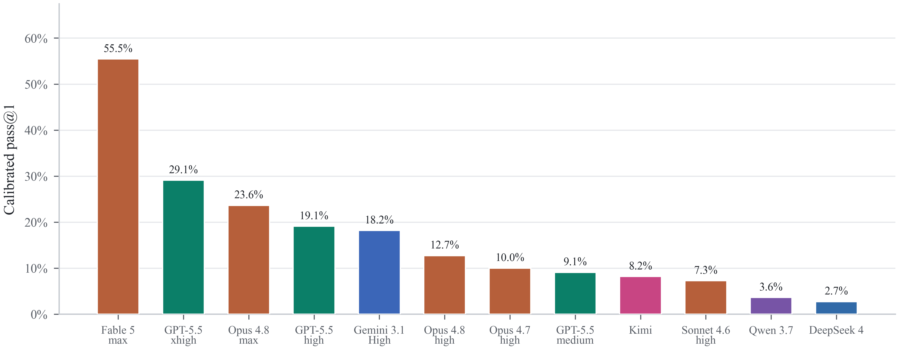

# GameEngineBench

GameEngineBench is a benchmark for evaluating coding agents on native C++ changes inside functioning Unreal Engine 5 projects. The current release evaluates 110 tasks drawn from nine real Unreal repositories. Each task gives the agent a buildable start state, scoped editable C++ files, and a behavior specification. After the solve phase, hidden tests are injected and run through Unreal automation, then judge auditing checks whether the result satisfies the requested behavior.

The benchmark targets runtime-integrated game-engine programming: server/client authority, replication, object lifecycle, subsystem initialization, persistence, UI and session flow, ability-system integration, and interactions across existing gameplay systems.

## Results

<p align="center">
  
</p>

<p align="center"><strong>Figure 1.</strong> Pass@1 on the active 110-task GameEngineBench evaluation set across evaluated model configurations.</p>

Across twelve evaluated configurations, the strongest result is `claude-fable-5` with `max` reasoning effort at 55.5% pass@1. The result is not mainly a syntax or compilation story: many failed runs compile and recover substantial local behavior, but miss one or more Unreal runtime contracts needed for the full task to work.

The paper figures and result summaries live under `paper/figures/` and `results/`.

## Contents

- `tasks_unreal/` - current Unreal benchmark task packages
- `unrealbench/src/ue_benchmark_runner.py` - main Unreal execution, solver orchestration, compilation, test injection, and artifact collection runner
- `unrealbench/src/` - solver wrappers, judge code, prompt utilities, and shared data types
- `unrealbench/src/authoring/` - task schema, migration, validation, enrichment, admission, and calibration utilities
- `paper/` - paper draft, figures, model notes, and bibliography
- `results/` - benchmark progress notes and result-analysis utilities
- `tv_frozen_workspace/` - frozen Unreal fixture used by parts of the benchmark tooling


## Benchmark Design

Each task package contains a start project, reference solution material, public task specification, editable-file scope, and hidden test assets. The runner copies the task into an isolated workspace, invokes a solver, compiles the resulting Unreal project, injects tests after the solver finishes, and records execution artifacts.

GameEngineBench measures behavioral correctness rather than reference similarity. A run can compile and still fail if it performs authoritative gameplay work on the wrong machine, omits replicated state needed by UI, cleans up actors at the wrong lifecycle point, or initializes a subsystem after dependent code expects it to exist.

The current task set spans gameplay mechanics, multiplayer behavior, AI and world orchestration, animation and movement, UI and session code, loading behavior, online-service integration, persistence, serialization, XR behavior, and rendering-oriented plugin code.

## Installation

### Prerequisites

1. Python 3.10+ for the benchmark package; Python 3.12+ is required for OpenHands integrations.
2. Unreal Engine 5 installed locally, with `UE_ENGINE_ROOT` pointing to the engine root.
3. Optional solver CLIs for whichever agents you plan to run.
4. EOS SDK for the EOSIntegrationKit tasks. The SDK itself is gitignored because it is large and licensed. Download it from the Epic Dev Portal, then run `python setup_eos_sdk.py` or pass `--sdk <path>`.

### Python Environment

```bash
python -m venv .venv
. .venv/bin/activate
pip install -e .
```

On Windows PowerShell:

```powershell
python -m venv .venv
.\.venv\Scripts\Activate.ps1
pip install -e .
```

Install Node dependencies only if you use tooling that requires the checked package dependency:

```bash
npm install
```

`node_modules/` is generated locally and is not tracked.

## Configuration

Copy `.env.example` to `.env` and set only the credentials needed for the agents you run. Key variables include:

- `UE_ENGINE_ROOT` - path to the local Unreal Engine installation
- `OPENAI_API_KEY` - required for Codex runs
- `CLAUDE_CODE_OAUTH_TOKEN` or `claude /login` - preferred for Claude Code benchmark runs
- `ANTHROPIC_API_KEY` - used by some authoring and pipeline utilities, not the benchmark Claude subscription path
- `QWEN_CODE_CMD` and `QWEN_CODE_ARGS` - optional Qwen Code command and non-interactive flags
- `KIMI_CODE_CMD` and `KIMI_CODE_ARGS` - optional Kimi Code command and flags
- `DEEPSEEK_CODE_CMD`, `GLM_CODE_CMD`, `MUSE_CODE_CMD` - optional terminal-agent wrapper commands

Benchmark Claude paths prefer Claude subscription authentication and temporarily ignore `ANTHROPIC_API_KEY` while the SDK is running. This applies to both the `claude-code` solver and the Unreal judge path.

## Running A Task

```bash
python -m unrealbench.src.ue_benchmark_runner \
  --tasks-dir tasks_unreal \
  --output results/ue_results.json \
  --agent codex \
  --model gpt-5.5 \
  --task-id ue_task_0020
```

Common options:

- `--agent` - `claude-code`, `codex`, `gemini-cli`, `qwen-code`, `kimi-code`, `openhands`, or a configured terminal-agent wrapper
- `--model` - model name passed through to the selected solver
- `--task-id` - one or more task IDs to run
- `--solver-timeout` - solver wall-clock timeout in seconds; default is 3600
- `--skip-judge` - skip LLM-as-judge after the snapshot is saved
- `--resume-from` - skip tasks already solved in a previous results JSON
- `--reasoning-level` - requested effort level for supported wrappers: `default`, `low`, `medium`, `high`, `xhigh`, or `max`

Run the configured model matrix from `run_manifest.yaml`:

```bash
python -m unrealbench.src.ue_benchmark_runner --manifest run_manifest.yaml
```

## Results And Artifacts

Snapshots are written under `tasks_unreal/test_result/<task-id>_<agent>_<timestamp>/` unless `GAMEDEVBENCH_RESULTS_DIR` overrides the root. Each snapshot includes the solver workspace, compile/test output, judge verdict, token/cost metadata when available, and the final `result.json`.

Inspect a snapshot with:

```bash
unrealbench-ue-show --snapshot <snapshot-path>
```

Provider CLIs that do not expose token usage leave token and cost fields unset rather than estimating silently.

## Citation

```bibtex
@misc{la2026gameenginebench,
      title={GameEngineBench: Evaluating Coding Agents on Real C++ Runtime Environments},
      author={Brian La and Sejoon Chang and Ben Kim and Junyoung Bae and Aamish Ahmad Beg and Sei Chang and Gonzalo Gonzalez-Pumariega},
      year={2026},
      note={Preprint},
}
```

This repository originated as a fork of [GameDevBench](https://github.com/waynechi/gamedevbench). The Unreal task format, runner, solvers, judge pipeline, authoring tooling, and benchmark methodology are independent work built on top of that foundation.

## License
